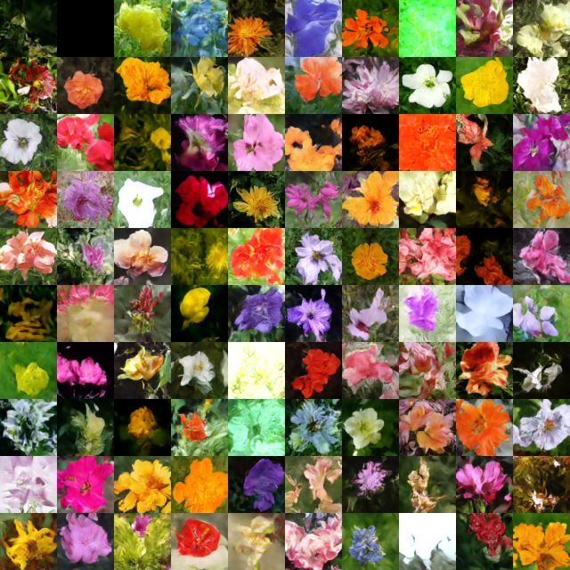

# Denoising Diffusion Probabilistic Models
PyTorch implementation of [DDPM](https://arxiv.org/abs/2006.11239), by Jonathan Ho, Ajay Jain, and Pieter Abbeel. 

Trained on [Flowers102](https://www.robots.ox.ac.uk/~vgg/data/flowers/102/) to generate images of flowers. Here are 100 images generated by the model:

## Run settings
- Trained on Colab's V100
- `1000` diffusion timesteps
- Optimizer: `Adam`
    - Initial learning rate: `2e-4`
        - Halved every `100` training epochs
- Batch size: `64`
- Number of training steps: `13733` (915 epochs)

## References
My main theoretical references were the following blog posts:
- [Song, Yang. (May 2021). Generative Modeling by Estimating Gradients of the Data Distribution](https://yang-song.net/blog/2021/score/)
    - Great for building intuition; it made everything click for me.
- [Weng, Lilian. (Jul 2021). What are diffusion models? Lil’Log.](https://lilianweng.github.io/posts/2021-07-11-diffusion-models/)
    - Helped a lot with the mathematical derivations.

## TODO
There's a lot to be done. Current version is essentially a proof of concept.
- [ ] Implement EMA
- [ ] Train on CelebA
- [ ] Implement interpolation
- [ ] Implement classifier guidance
