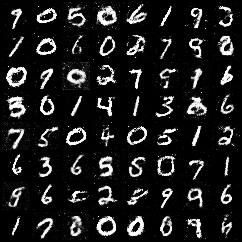

A PyTorch implementation of [Generative Adversarial Networks](https://arxiv.org/abs/1406.2661).

Samples generated by the model trained on MNIST:



My main reference was [Probabilistic Machine Learning: Advanced Topics](https://probml.github.io/pml-book/book2.html), by Kevin Patrick Murphy. 

#### Dependecies:

- numpy
- pytorch

## References

```bibtex
@misc{goodfellow2014generativeadversarialnetworks,
      title={Generative Adversarial Networks}, 
      author={Ian J. Goodfellow and Jean Pouget-Abadie and Mehdi Mirza and Bing Xu and David Warde-Farley and Sherjil Ozair and Aaron Courville and Yoshua Bengio},
      year={2014},
      eprint={1406.2661},
      archivePrefix={arXiv},
      primaryClass={stat.ML},
      url={https://arxiv.org/abs/1406.2661}, 
}
```

```bibtex
@book{pml2Book,
 author = "Kevin P. Murphy",
 title = "Probabilistic Machine Learning: Advanced Topics",
 publisher = "MIT Press",
 year = 2023,
 url = "http://probml.github.io/book2"
}
```