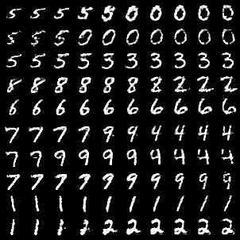

# InfoGAN

A PyTorch implementation of [InfoGAN: Interpretable Representation Learning by Information Maximizing Generative Adversarial Nets](https://arxiv.org/abs/1606.03657). 

In this implementation, a simple MLP is used for both the generator and the shared network. The shared network is composed of the discriminator and an auxiliary network, which maximizes the [mutual information](https://en.wikipedia.org/wiki/Mutual_information) between a subset of latent variables and the generated samples.


## Implementation details

- Architecture: Simple MLP for both generator and shared network.
- Latent variables: The latent space consists of a categorical distribution and a uniform distribution.

This implementation is heavily based on the [oficial implementation](https://github.com/openai/InfoGAN).


## Generated samples

Here are some images generated by the model trained on MNIST for 2000 epochs:



In the generated images:
- Each row corresponds to a fixed sample from the categorical latent variable.
- The columns show a interpolation of the uniform latent variable.
- The same uniform random noise is used for all digits in every row.

## References

```bibtex
@misc{chen2016infoganinterpretablerepresentationlearning,
      title={InfoGAN: Interpretable Representation Learning by Information Maximizing Generative Adversarial Nets}, 
      author={Xi Chen and Yan Duan and Rein Houthooft and John Schulman and Ilya Sutskever and Pieter Abbeel},
      year={2016},
      eprint={1606.03657},
      archivePrefix={arXiv},
      primaryClass={cs.LG},
      url={https://arxiv.org/abs/1606.03657}, 
}
```