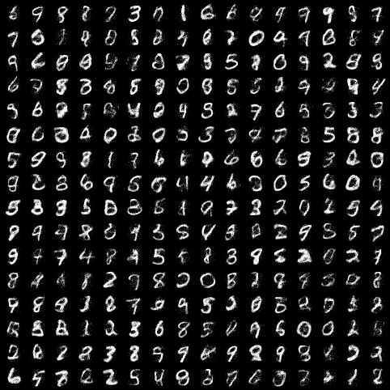

# NICE: Non-linear Independent Components Estimation

PyTorch implementation of [NICE](https://arxiv.org/abs/1410.8516), by Laurent Dinh, David Krueger and Yoshua Bengio. 



Achieved a test-set log likelihood of `1974.36` on epoch 75 (authors reported `1980.50`)

## Usage
```bash
python train.py
```
The train.py script accepts the following arguments:

```bash
optional arguments:
  -h, --help           show this help message and exit
  --batch-size N       input batch size for training (default: 64)
  --test-batch-size N  input batch size for testing (default: 256)
  --epochs N           number of epochs to train (default: 75)
  --cuda               train on CUDA (default: True)
  -j N, --workers N    number of data loading workers (default: 4)
  --log-interval N     how many batches to wait before logging training status (default: 100)
```

## Run settings
- Trained on [Colab](https://colab.google/)
- Prior: Logistic
	- [Logistic distribution in PyTorch](https://pytorch.org/docs/stable/distributions.html#torch.distributions.transformed_distribution.TransformedDistribution)
- 4 additive coupling layers
	- ReLU activation function; 5 hidden layers with 1000 units and no batch normalization
- Optimizer: Adam (default hyperparameters); exponential learning rate decay
- Dequantization: Uniform (add uniform noise, divide by 256)

| Batch size | Number of epochs | Initial lr | gamma | 
| ---------- | ---------------- | ---------- | ----- |
| `64`         | `75`               | `1e-3`       | `0.9`   |


## Helpful references
References that helped me during implementation:
- Karpathy's [implementation](https://github.com/karpathy/pytorch-normalizing-flows) of some flow-based models
- DakshIdnani's [implementation](https://github.com/DakshIdnani/pytorch-nice) of NICE
- Great [blog post](https://bjlkeng.io/posts/normalizing-flows-with-real-nvp/) by Brian Keng
	- Introduces flow-based models and talks about his implementation of [Real NVP](https://arxiv.org/abs/1605.08803). Helped me a lot with NICE (especially his section on data preprocessing)
- [A note on the evaluation of generative models](https://arxiv.org/abs/1511.01844)
- https://uvadlc-notebooks.readthedocs.io/en/latest/tutorial_notebooks/tutorial11/NF_image_modeling.html#Dequantization
- MaximeVandegar's [implementation](https://github.com/MaximeVandegar/Papers-in-100-Lines-of-Code/tree/main/NICE_Non_linear_Independent_Components_Estimation) of NICE
	- Delightfully simple
