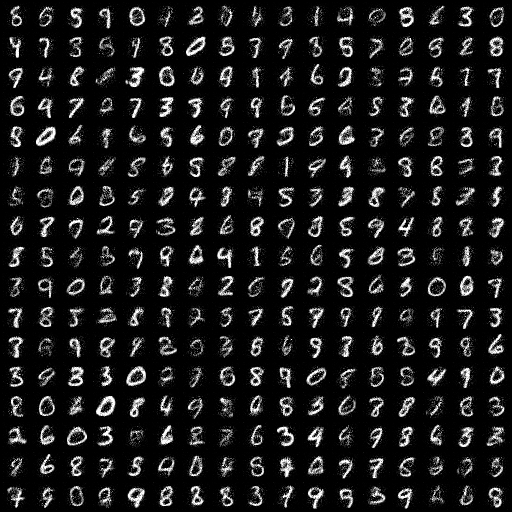

# NICE: Non-linear Independent Components Estimation

PyTorch implementation of [NICE](https://arxiv.org/abs/1410.8516), by Laurent Dinh, David Krueger and Yoshua Bengio.

Here are 289 images generated by the model trained on MNIST:

Achieved a test-set log likelihood of `2061.01` on epoch `14`

## Run settings
- Trained on Colab's V100
- Optimizer: `Adam`
    - Initial learning rate: `2e-3`
        - Cosine annealing LR scheduler
- Batch size: `256`
- Number of training steps: `~2925` (14 epochs)

## Helpful references
References that helped me during implementation:
- Karpathy's [implementation](https://github.com/karpathy/pytorch-normalizing-flows) of some flow-based models
- DakshIdnani's [implementation](https://github.com/DakshIdnani/pytorch-nice) of NICE
- Great [blog post](https://bjlkeng.io/posts/normalizing-flows-with-real-nvp/) by Brian Keng
	- Introduces flow-based models and talks about his implementation of [Real NVP](https://arxiv.org/abs/1605.08803). Helped me a lot with NICE (especially his section on data preprocessing)
- https://uvadlc-notebooks.readthedocs.io/en/latest/tutorial_notebooks/tutorial11/NF_image_modeling.html#Dequantization
- MaximeVandegar's [implementation](https://github.com/MaximeVandegar/Papers-in-100-Lines-of-Code/tree/main/NICE_Non_linear_Independent_Components_Estimation) of NICE
- https://pytorch.org/docs/stable/distributions.html#torch.distributions.transformed_distribution.TransformedDistribution