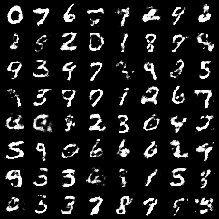

# WGAN

A minimal PyTorch implementation of [Wasserstein GAN](https://arxiv.org/abs/1701.07875). This repository trains a simple MLP to generate MNIST images.

Here are some images generated by the model trained for 1500 epochs:




My main theoretical reference was [Probabilistic Machine Learning: Advanced Topics](https://probml.github.io/pml-book/book2.html), by Kevin Patrick Murphy.


---

#### Implementation Details

- Architecture: Simple MLP for both generator and critic.
- Dataset: MNIST.
- Training duration: 1500 epochs with batch size 64.

---

## References

```bibtex
@misc{arjovsky2017wassersteingan,
      title={Wasserstein GAN}, 
      author={Martin Arjovsky and Soumith Chintala and Léon Bottou},
      year={2017},
      eprint={1701.07875},
      archivePrefix={arXiv},
      primaryClass={stat.ML},
      url={https://arxiv.org/abs/1701.07875}, 
}
```

```bibtex
@book{pml2Book,
      author = "Kevin P. Murphy",
      title = "Probabilistic Machine Learning: Advanced Topics",
      publisher = "MIT Press",
      year = 2023,
      url = "http://probml.github.io/book2"
}
```